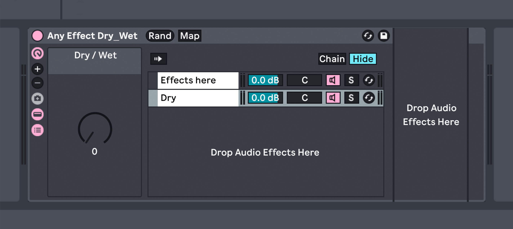

<div align="center">

# Any Effect Dry/Wet (Ableton Effect Rack)
This is an attempt at creating a custom Effect Rack that gives the user a simple Dry/Wet knob for any Effect or Instrument.

This can be useful in many cases. Such as, using my previous Effect Rack [Chain me up](https://github.com/fonkley/chainmeup/), or any other audio effect that doesn't have a global dry/wet knob — for example, "EQ Eight".



</div>

## Requirements
- Ableton Live 12.0.0 or above

## How to use
- First, insert the rack into your desired track.
- Then, drag any effect — or multiple effects — into the area on the right of the rack that states ``` Drop Audio Effects Here ```
  - This is the section directly to the right of the "Chain List".
- Finally, dial the "Dry / Wet" macro to your desired dry/wet amount.

If you want, you could also select the (Rand) button to the right of the rack's name for a completely randomised selection.

## Installation
### Windows
- First, locate your Ableton User Library.
  - To do this, open Ableton Live and select Options > Preferences > Library
  - Under "Content Locations", you will find your User Library's directory under the option "Location of User Library".
  - The most common location of your User Library is,
    ```
    C:\Users\[username]\Documents\Ableton\User Library
    ```
- Next, locate the "Audio Effect Rack" custom preset folder.
  - The "Audio Effect Rack" directory is most likely,
    ```
    [Ableton User Library]\Presets\Audio Effects\Audio Effect Rack
    ```
- Then, go to the [Releases page](https://github.com/fonkley/anyeffectdrywet/releases/)
  - Download `Any.EffectDry_Wet.adg` from the latest release.
<br> </br>
- Finally, move the `Any.EffectDry_Wet.adg` file from your downloads folder, to the `\Audio Effect Rack` directory.
<br> </br>
### macOS
- First, locate your Ableton User Library.
  - To do this, open Ableton Live and select Live > Preferences > Library
  - Under "Content Locations", you will find your User Library's directory under the option "Location of User Library".
  - The most common location of your User Library is,
    ```
    Macintosh HD/Users/[username]/Music/Ableton/User Library
    ```
- Next, locate the "Audio Effect Rack" custom preset folder.
  - The "Audio Effect Rack" directory is most likely,
    ```
    [Ableton User Library]/Presets/Audio Effects/Audio Effect Rack
    ```
- Then, go to the [Releases page](https://github.com/fonkley/anyeffectdrywet/releases/)
  - Download `Any.EffectDry_Wet.adg` from the latest release.
<br> </br>
- Finally, move the `Any.EffectDry_Wet.adg` file from your downloads folder, to the `/Audio Effect Rack` directory.
